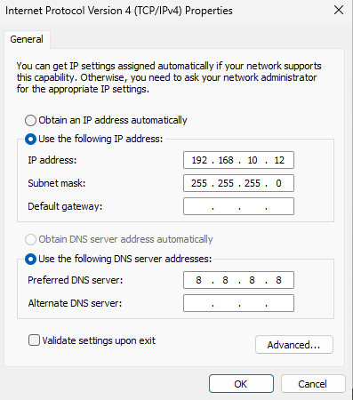
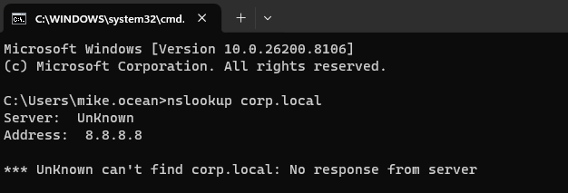
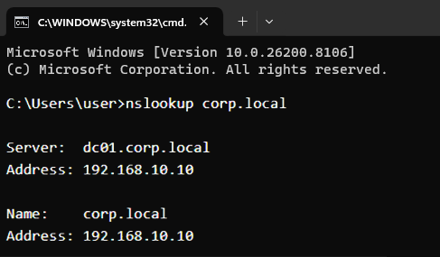

# Ticket: Users Unable to Access Internal Application Due to DNS Resolution Failure

[← Back to README](../README.md)

---

## Environment
- Windows Server 2019 (Domain Controller + DNS)
- Windows 11 Client 
- Active Directory Domain

---

## User Impact
A user was unable to access an internal application required for normal work tasks.  
This prevented authentication and use of domain-based services.

---

## Issue Summary
The user reported that they could not access the application login page, despite having a working internet connection. The issue appeared isolated to the client machine.

---

## Initial Symptoms
- Application URL failed to load in browser
- General internet access was working
- Domain-based services were not functioning correctly
- No error indicating account lockout or credential failure

---

## Investigation Steps

1. **Verified Network Connectivity**
   - Successfully pinged external hosts (e.g., Google)
   - Confirmed internet access was not the issue

2. **Tested Application Access**
   - Attempted to load application URL in browser
   - Page failed to resolve

3. **Performed DNS Lookup**
   - Used `nslookup` to resolve domain name
   - DNS resolution failed

4. **Tested Domain Controller Discovery**
   - Used `nltest /dsgetdc:<domain>`
   - Domain controller could not be located

5. **Reviewed Network Configuration**
   - Checked client DNS settings using `ipconfig /all`
   - Identified incorrect DNS server configured on client

---

## Findings
- The client machine was not using the internal domain DNS server
- DNS queries for the domain were failing
- This prevented domain controller discovery and authentication

---

## Root Cause
The client was configured with an incorrect DNS server, preventing proper domain name resolution and access to internal services.

---

## Resolution
- Updated the client DNS settings to point to the correct internal DNS server (domain controller)
- Flushed DNS cache using: `ipconfig /flushdns`
- Re-tested domain resolution and application access

---

## Validation
- `nslookup` successfully resolved domain name
- Domain controller discovery succeeded
- Application login page loaded correctly
- User was able to authenticate successfully

---

## Evidence

### Incorrect DNS Configuration

### DNS Resolution Failure

### DNS Fixed

---

## Key Takeaway
This issue highlights the importance of correct DNS configuration in Active Directory environments, where name resolution is critical for authentication and application access.

---

## Skill Demonstrated
Network and DNS troubleshooting in a domain environment, including isolation of application vs infrastructure-level issues.
