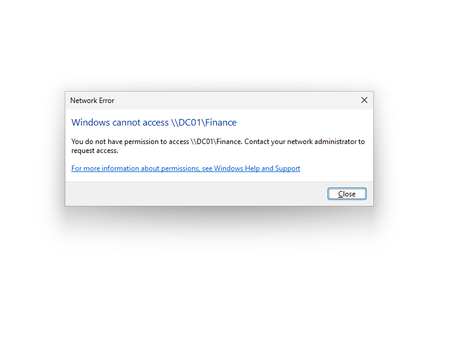
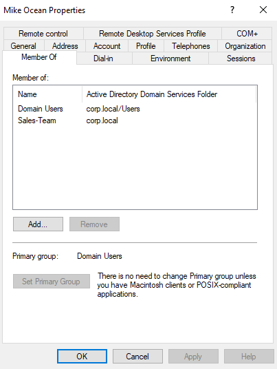
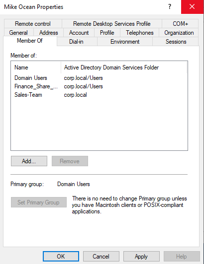
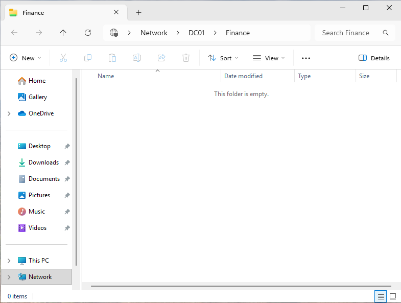

# Ticket: User Unable to Access Department Shared Folder Due to Permission Misconfiguration

[← Back to README](../README.md)

---

## Environment
- Windows Server 2019 (File Server)
- Windows 11 Client
- Active Directory Domain

---

## User Impact
A user was unable to access a department shared folder required for daily work tasks.  
This prevented them from retrieving and saving files needed for their role.

---

## Issue Summary
The user reported receiving an "Access Denied" error when attempting to open a shared network folder. Authentication to the domain was successful, and other network resources were accessible.

---

## Initial Symptoms
- User successfully logged into domain
- Network connectivity to file server confirmed
- Shared folder path was reachable
- "Access Denied" error when opening specific folder
- Other users in the same department had access

---

## Investigation Steps

1. **Verified User Authentication**
   - Confirmed successful domain login
   - No account lockout or credential issues

2. **Tested Network Connectivity**
   - Verified access to file server via hostname and IP
   - Confirmed no network-level issues

3. **Reproduced the Issue**
   - Attempted to access shared folder from affected user account
   - Confirmed consistent "Access Denied" error

4. **Reviewed Share Permissions**
   - Checked shared folder permissions on server
   - Verified correct group had access at share level

5. **Reviewed NTFS Permissions**
   - Inspected security permissions on folder
   - Identified mismatch between share and NTFS permissions

6. **Checked User Group Membership**
   - Compared affected user with a working user
   - Identified missing security group assignment

---

## Findings
- Share permissions allowed access to the correct group
- NTFS permissions were more restrictive
- Affected user was not part of the required security group
- This resulted in effective access being denied 

---

## Root Cause
The user was not assigned to the correct Active Directory security group, and NTFS permissions on the folder restricted access to authorized group members only.

---

## Resolution
- Added user to the appropriate Active Directory security group
- Logged the user out and back in to refresh security token
- Re-tested access to shared folder

---

## Validation
- User successfully accessed the shared folder
- Files were visible and accessible
- No additional permission changes were required

---

## Evidence

### Access Denied Error

### Group Membership Comparison

### Adding User to Security Group

### Access Restored

---

## Key Takeaway
This scenario demonstrates how effective permissions are determined by both share and NTFS permissions, and how group membership directly impacts resource access in an Active Directory environment.

---

## Skill Demonstrated
Active Directory access control troubleshooting, including group membership validation and analysis of share vs NTFS permission behavior.