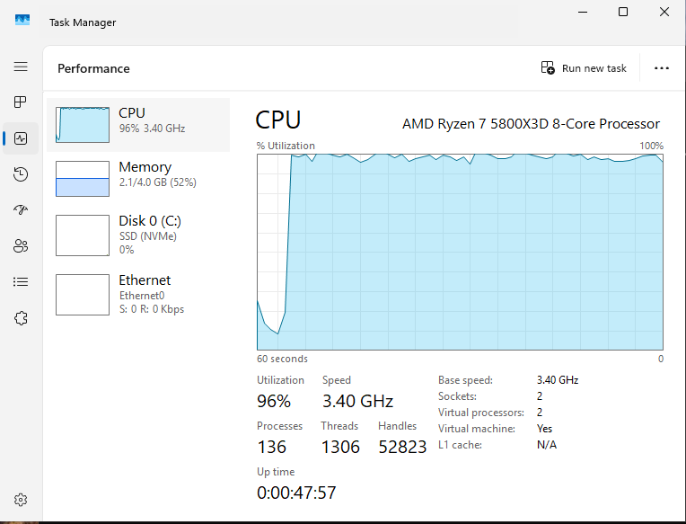
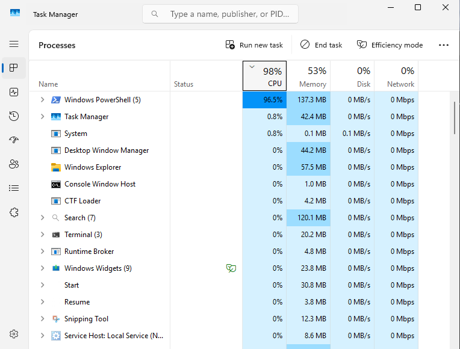
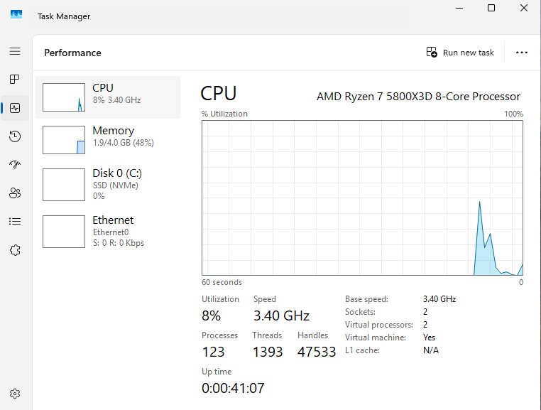

# Ticket: Workstation Performance Degradation Due to High CPU Utilization

[← Back to README](../README.md)

---

## Environment
- Windows 11 Client
- Active Directory Domain Environment

---

## User Impact
User experienced significant system slowdown, affecting their ability to perform normal work tasks such as opening applications, browsing, and accessing files.

---

## Issue Summary
The user reported that their workstation was extremely slow, with delayed response times and system freezing during normal usage.

---

## Initial Symptoms
- Slow login and delayed desktop load
- Applications taking longer than normal to open
- System lag when switching between tasks
- High CPU usage observed

---

## Investigation Steps

1. **Reproduced the Issue**
   - Logged into affected workstation
   - Observed noticeable system lag

2. **Checked Resource Utilization**
   - Opened Task Manager
   - Identified CPU usage consistently near 90–100%

3. **Identified Resource-Heavy Process**
   - Sorted processes by CPU usage
   - Located a process consuming excessive CPU resources

4. **Analyzed Process Behavior**
   - Confirmed the process was not critical to system operation
   - Determined it was safe to terminate

---

## Findings
- A single background process was consuming the majority of CPU resources
- This caused system-wide performance degradation
- No hardware or network issues were identified

---

## Root Cause
A resource-intensive background process was continuously consuming CPU, resulting in reduced system performance.

---

## Resolution
- Terminated the high-CPU process via Task Manager
- Ensured the process was not configured to start automatically
- Restarted the system to confirm stability

---

## Validation
- CPU usage returned to normal levels (under 20%)
- System responsiveness significantly improved
- Applications opened and functioned normally
- User confirmed issue was resolved

---

## Evidence

### High CPU Usage Before Fix

### Process Causing Issue

### CPU Usage After Fix

---

## Key Takeaway
This scenario highlights the importance of monitoring system resource usage and identifying abnormal processes when diagnosing performance-related issues.

---

## Skill Demonstrated
Endpoint performance troubleshooting, including resource analysis and process-level investigation.