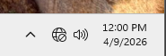
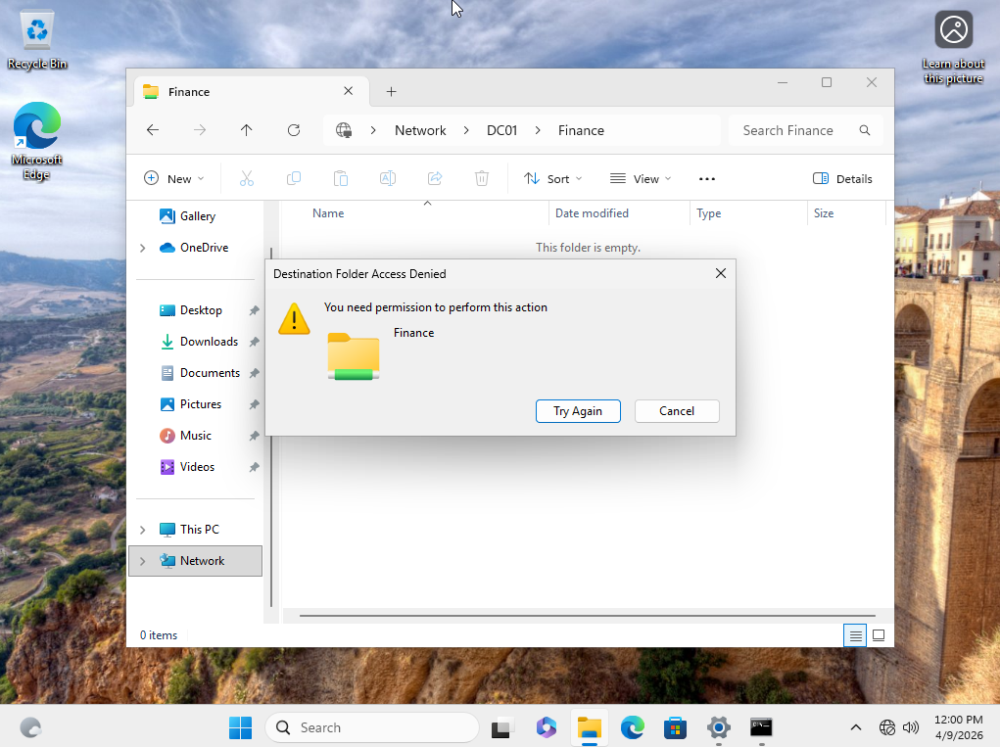
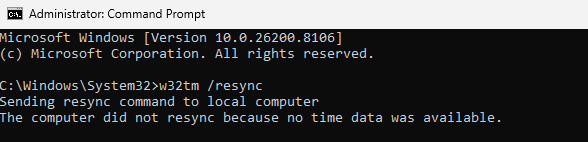
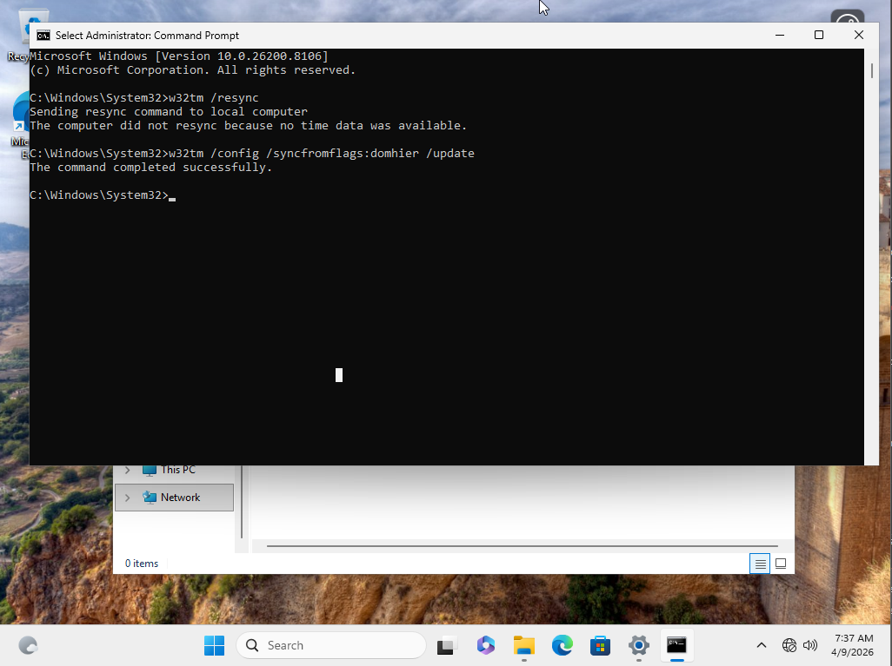
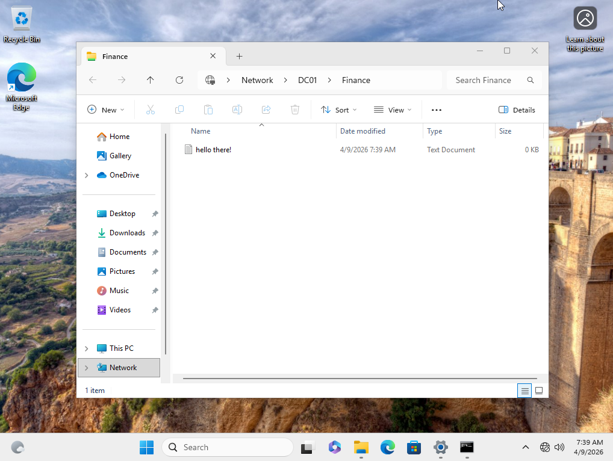

# Ticket: User Unable to Access Shared Resource Due to Time Synchronization Issue

[← Back to README](../README.md)

---

## Environment
- Windows Server 2019 (Domain Controller: DC01)
- Windows 11 Client (Domain Joined)
- Active Directory Domain Services
- SMB Shared Folder (\\DC01\Finance)

---

## Issue
User reported inability to access internal shared resource despite previously working access.

---

## Investigation
- Verified user credentials were correct
- Confirmed user had appropriate group membership
- Tested network connectivity and DNS resolution
- Attempted access to shared folder via \\DC01\Finance
- Observed authentication failure despite valid permissions
- Checked client system time and identified mismatch with domain controller

---

## Findings
- Client system time was significantly out of sync with the domain controller
- Kerberos authentication failed due to time difference
- Automatic time synchronization was unsuccessful

---

## Root Cause
Kerberos authentication failed due to excessive time drift between the client system and domain controller, preventing proper ticket validation.

---

## Resolution
- Manually corrected system time on the client machine
- Cleared cached Kerberos tickets using `klist purge`
- Verified successful authentication and access to shared resource

---

## Screenshots

### Incorrect System Time

### Authentication Failure Accessing Shared Resource

### Failed Automatic Time Resynchronization

### Time Correction

### Access Restored
